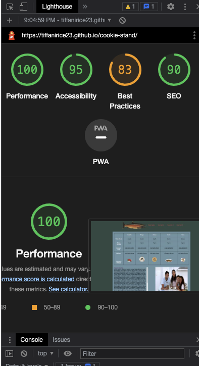

## Cookie Stand

I build an app with a direct and powerful purpose. It does all of the things that it accomplishes well. I should describe the purpose and functionality so those that visit my README understand the app

### Author:  Tiffani Rice
Resources: Dan Quinn (for JS table)
- (Remove Element by ID for lab09)[https://stackoverflow.com/questions/3387427/remove-element-by-id]

### Links and Resources

* [submission PR](http://xyz.com)
* Any Links you used as reference

### Lighthouse Accessibility Report Score

Lab10b Lighthouse

Lab09 Lighthouse

* Provide a screenshot of your score after running a Lighthouse Accessibility report.

### Reflections and Comments

* Consider including the answers to your daily journal and submission questions here
* This is also a good place to reflect on the tools and resources used and learned
